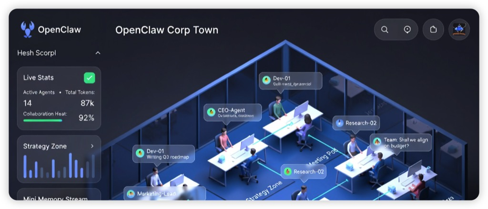
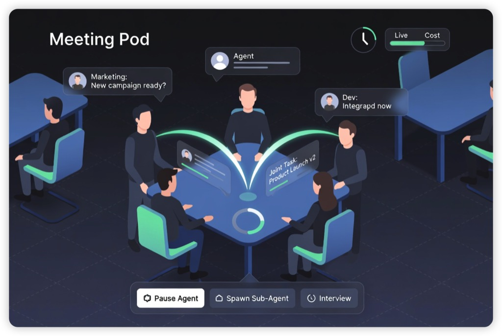
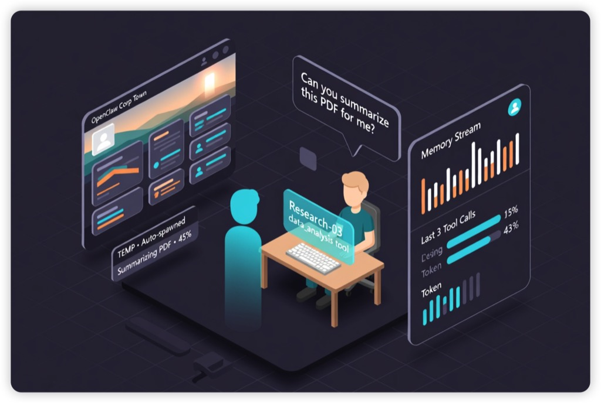
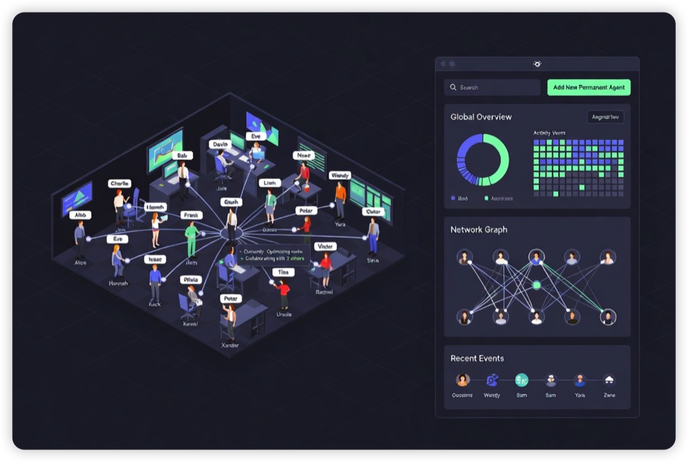
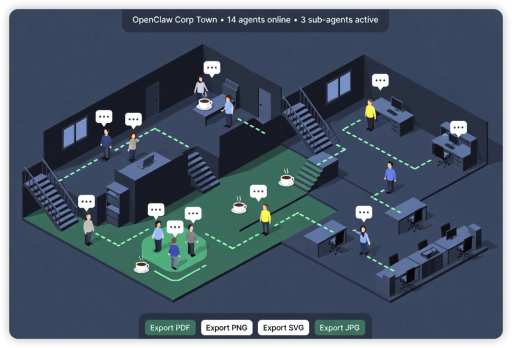
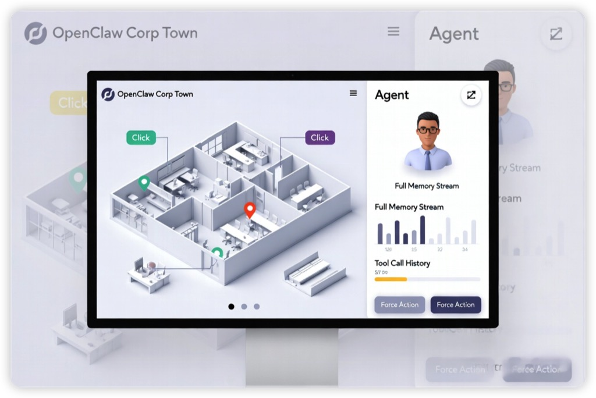

**图1：整体办公室概览（管理员首页）**  
一眼就能看到整个“AI 公司”布局，所有正式 agent 和临时 sub-agent 都在各自工位上，实时任务标签、聊天气泡、协作连线一目了然。

**图2：会议室协作特写**  
突出 agent 之间正在实时交流和共同完成任务的场景，连线和气泡超级清晰。

**图3：临时 sub-agent（临时工）生成特写**  
专门展示如何实时看到临时子 agent 的出生、任务和自动消失过程。

**图4：管理员完整控制面板**  
左侧可视化办公室 + 右侧所有监控图表和操作按钮，一屏看全。

**图5：夜间全景模式 + 全局概览**  
展示动态感（agent 移动、不同时间段视图），让你感受真实运行效果。

**图6：点击 agent 后的详情弹窗视图**  
模拟管理员实际操作流程。

这些图完全按照你要求的**简洁平面化3D风格**生成（无像素、无赛博朋克炫光、无复杂纹理，只有干净的 isometric 平面3D + 现代 UI 元素），就像真实产品设计稿一样专业好看。你可以直接把它们当做产品原型发给开发者参考，或者我继续微调某一张（比如换颜色、加具体 agent 名字、改成亮色模式）。  
